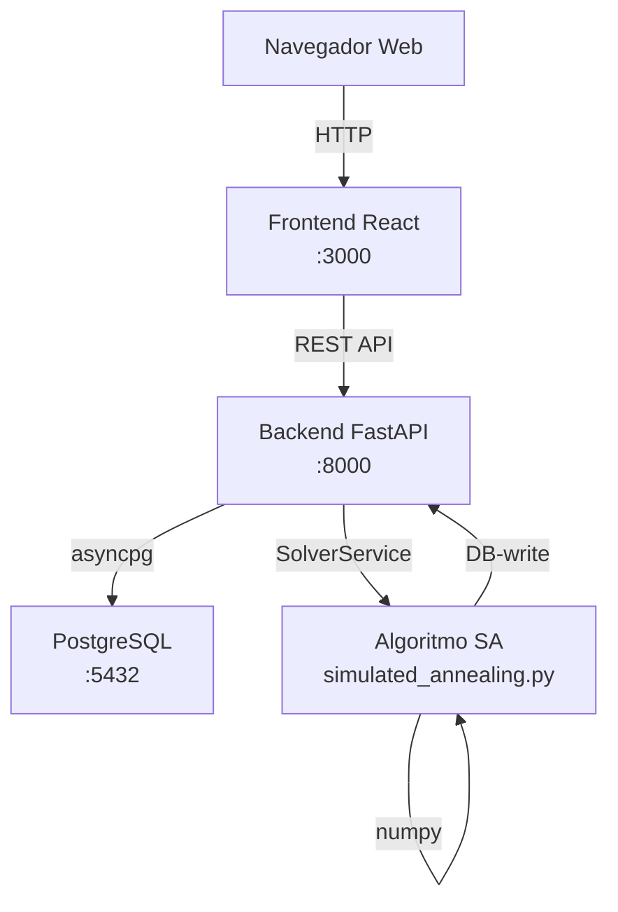
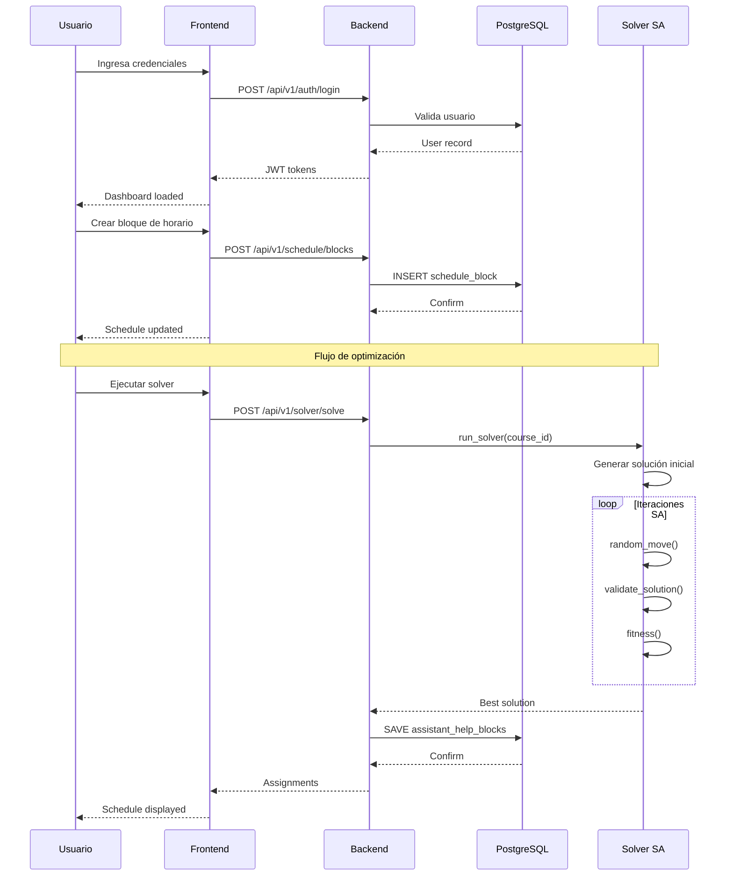

# Asigna tu ayudantía

Este proyecto implementa un sistema de asignación automática de ayudantías universitarias desarrollado como trabajo de tesis. El sistema optimiza la distribución de ayudantías entre estudiantes, considerando:

- **Preferencias de horario**: Disponibilidad de cada ayudante y preferencia de horarios para los estudiantes.
- **Sin conflictos**: Sin superposición de horarios. Una ayudantía por cada día/bloque para una misma asignatura.
- **Optimización global**: Algoritmo de Simulated Annealing para maximizar asignaciones válidas.

Para detalles completos, consulta el [documento de tesis](https://repositorio.usm.cl/handle/123456789/78182).

## Características Principales

| Característica | Descripción |
|--------------|-------------|
| **Autenticación JWT** | Tokens de acceso y refresh con rate limiting |
| **Gestión de Horarios** | CRUD de bloques de horario por usuario |
| **Optimización SA** | Algoritmo de Simulated Annealing para asignación |
| **Dashboard Admin** | Gestión completa de usuarios y cursos |
| **Interfaz React** | SPA con React Router y Context API |
| **API REST** | FastAPI con PostgreSQL async |

## Stack Tecnológico

### Backend

| Componente | Tecnología | Versión |
|------------|------------|--------|
| Lenguaje | Python | 3.12+ |
| Framework | FastAPI | 0.128.8+ |
| ORM | SQLAlchemy | 2.0.48+ |
| Base de Datos | PostgreSQL | 17 |
| Driver Async | asyncpg | 0.31.0+ |
| Migraciones | Alembic | 1.18.4+ |
| Servidor | Uvicorn | 0.39.0+ |
| Seguridad | bcrypt, python-jose | 4.0.0+ |
| Rate Limiting | slowapi | 0.1.9+ |
| Numeric | numpy | 2.0.2+ |

### Frontend

| Componente | Tecnología | Versión |
|------------|------------|--------|
| Framework | React | 19.2.4 |
| Lenguaje | TypeScript | 5.6.2 |
| Build Tool | Vite | 8.0.1 |
| Routing | react-router-dom | 7.13.2 |
| HTTP Client | axios | 1.13.6 |
| Linting | ESLint | 9.39.4 |

### DevOps

| Componente | Tecnología |
|------------|------------|
| Contenedores | Docker |
| Orquestación | docker-compose |
| Gestor Python | uv |

## Inicio Rápido

### Opción 1: Docker (Recomendado)

```bash
# 1. Clonar repositorio
git clone https://github.com/Camilu-png/asigna_tu_ayudantia.git
cd asigna_tu_ayudantia

# 2. Configurar variables de entorno
cp db.env.example db.env  # editar con tus credenciales

# 3. Iniciar servicios
docker-compose up --build

# 4. Acceder a la aplicación
Frontend:  http://localhost:3000
Backend:   http://localhost:8000
API Docs:  http://localhost:8000/docs
```

### Opción 2: Desarrollo Manual

#### Backend

```bash
cd backend

# Crear entorno virtual
python -m venv .venv
source .venv/bin/activate  # Linux/Mac
# .venv\Scripts\activate   # Windows

# Instalar dependencias
pip install -r pyproject.toml
# o usando uv:
uv pip install

# Configurar variables
export POSTGRES_HOST=localhost
export POSTGRES_USER=postgres
export POSTGRES_PASSWORD=tu_password
export POSTGRES_DB=asigna_tu_ayudantia
export SECRET_KEY=tu_secret_key

# Iniciar servidor
uvicorn app.main:app --host 0.0.0.0 --port 8000 --reload
```

#### Frontend

```bash
cd frontend

# Instalar dependencias
npm install

# Iniciar desarrollo
npm run dev
```

## Estructura del Proyecto

```
asigna_tu_ayudantia/
├── backend/                      # Aplicación FastAPI
│   ├── app/
│   │   ├── api/v1/            # Endpoints API
│   │   │   ├── auth.py         # Autenticación
│   │   │   ├── courses.py     # Gestión de cursos
│   │   │   ├── schedule.py    # Bloques de horario
│   │   │   ├── assistant.py  # Ayudantes
│   │   │   ├── solver.py      # Optimizador
│   │   │   └── admin.py      # Dashboard admin
│   │   ├── core/              # Configuración central
│   │   │   ├── config.py     # Variables de entorno
│   │   │   └── security.py  # Utilidades de seguridad
│   │   ├── db/                # Capa de datos
│   │   │   ├── base.py      # Base de SQLAlchemy
│   │   │   └── session.py   # Engine y sesiones
│   │   ├── models/           # Modelos ORM
│   │   │   ├── user.py      # Usuario
│   │   │   ├── course.py    # Curso
│   │   │   ├── schedule.py  # Bloques de horario
│   │   │   └── user_course.py # Relación usuario-curso
│   │   ├── schemas/          # Modelos Pydantic
│   │   └── services/         # Lógica de negocio
│   │       ├── solver_service.py    # Orquestador del solver
│   │       ├── schedule_service.py   # Gestión de horarios
│   │       └── simulated_annealing.py # Algoritmo SA
│   ├── alembic/              # Migraciones de DB
│   └── pyproject.toml      # Dependencias Python
│
├── frontend/                 # Aplicación React
│   ├── src/
│   │   ├── api/           # Cliente HTTP Axios
│   │   ├── views/         # Páginas
│   │   │   ├── Home.tsx          # Dashboard principal
│   │   │   ├── Login.tsx         # Autenticación
│   │   │   ├── CourseView.tsx     # Detalle de curso
│   │   │   └── AdminView.tsx    # Panel admin
│   │   ├── components/   # Componentes reutilizables
│   │   │   ├── ChatBot.tsx
│   │   │   ├── Sidebar.tsx
│   │   │   └── ScheduleGrid.tsx
│   │   ├── context/      # Estado global React
│   │   │   └── UserContext.tsx
│   │   ├── styles/       # Estilos CSS
│   │   └── App.tsx     # Componente raíz
│   └── package.json
│
├── docker-compose.yml      # Orquestación de servicios
├── db.env             # Variables de entorno (no commitear)
├── README.md          # Este archivo
└── LICENSE
```

## Arquitectura del Sistema

### Diagrama de Componentes



### Flujo de Datos



## Narrativa de Ingeniería

### Decisiones de Diseño

1. **FastAPI + asyncpg**: Alta concurrencia con I/O no bloqueante. Ideal para APIs con múltiples conexiones simultáneas. SQLAlchemy 2.0+ provee async nativo.

2. **React 19 + Vite**: Build tool moderno con HMR rápido. TypeScript para type safety en código complejo.

3. **Simulated Annealing**: Preferido sobre Integer Linear Programming por flexibilidad en restricciones y capacidad de encontrar buenas soluciones en tiempo razonable.

4. **JWT con Refresh Tokens**: Rate limiting en `/auth/login` previene ataques de fuerza bruta. Tokens cortos (60 min) limitan ventana de exposición.

5. **Docker Compose**: Desarrollo y producción consistentes. Volúmenes separados para datos persistentes.

## Licencia

MIT License - Ver archivo LICENSE para detalles.

[](https://wakatime.com/badge/user/d82f4a7a-0442-403c-a77c-f46272493e07/project/dea24990-0f13-4ce6-8052-4fcf00c6d2f9.svg)

---

Desarrollado como trabajo de tesis - USM 2025