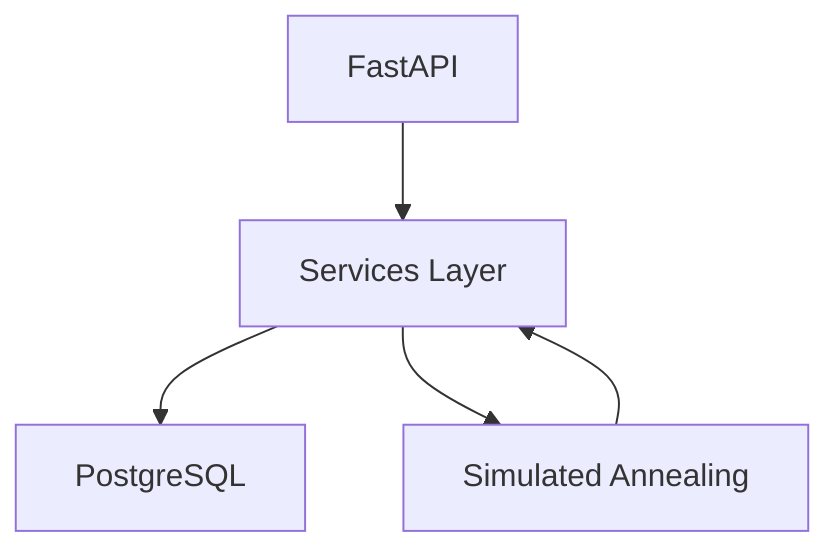
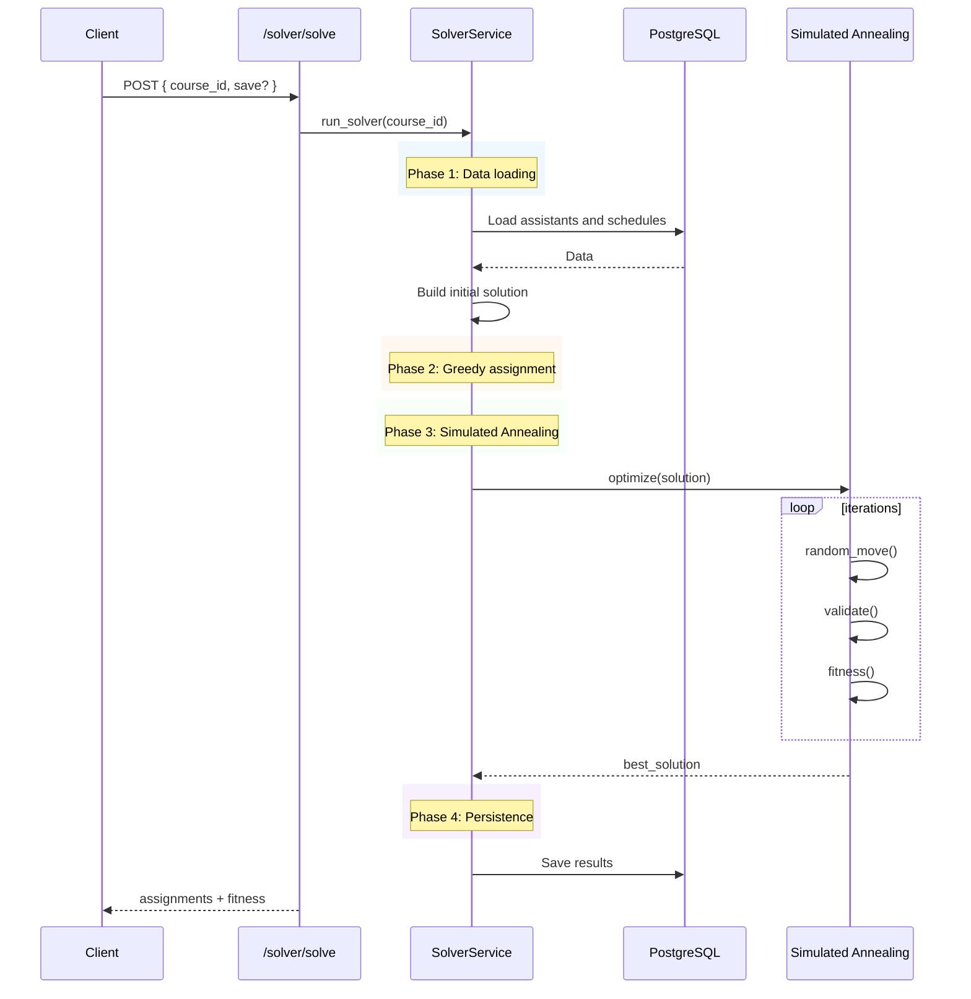

# Backend - Asigna tu ayudantía

FastAPI-based backend exposing a REST API for authentication, schedule management, course administration, and assistant assignment via optimization.

This service is the core of the system, handling business logic, persistence, and execution of the Simulated Annealing solver.

---

## 🚀 Quick Start

```bash
cd backend

docker compose up --build
````

API available at: [http://localhost:8000](http://localhost:8000)
Interactive docs: [http://localhost:8000/docs](http://localhost:8000/docs)

> ⚠️ Requires PostgreSQL running and environment variables configured

---

## 🎯 What does this API provide?

* JWT-based authentication (access + refresh tokens)
* Course and user management
* Schedule block CRUD operations
* Assistant assignment optimization (Simulated Annealing)
* Admin-level system control

---

## 🔑 Key Endpoints

| Method | Endpoint                | Description                             |
| ------ | ----------------------- | --------------------------------------- |
| POST   | `/auth/login`           | Authenticate user and return JWT tokens |
| POST   | `/auth/refresh`         | Refresh access token                    |
| GET    | `/courses`              | List available courses                  |
| POST   | `/schedule/blocks`      | Create schedule block                   |
| DELETE | `/schedule/blocks/{id}` | Delete schedule block                   |
| POST   | `/solver/solve`         | Run optimization for a course           |
| GET    | `/admin/users`          | Admin: list users                       |

---

## 🔄 Typical Usage Flow

1. User logs in → receives JWT tokens
2. User defines availability (schedule blocks)
3. Admin assigns assistants or triggers solver
4. System runs optimization and returns assignments
5. Results are stored and visualized in frontend

---

## 🏗️ Architecture Overview



* **API layer**: request handling and routing
* **Services layer**: business logic
* **Database**: persistent storage
* **Solver**: optimization engine

---

## 🧠 Solver Flow (Simulated Annealing)



---

## 🧩 Core Components

### Services

* **SolverService**
  Orchestrates optimization, prepares data, and persists results

* **ScheduleService**
  Handles schedule block operations and validation

* **simulated_annealing.py**
  Implements optimization logic:

  * fitness evaluation
  * random moves (shift, swap, unassign)
  * constraint validation

---

## 🗄️ Data Model

| Model              | Table                   |
| ------------------ | ----------------------- |
| User               | `users`                 |
| Course             | `courses`               |
| ScheduleBlock      | `schedule_blocks`       |
| UserCourse         | `user_courses`          |
| AssistantHelpBlock | `assistant_help_blocks` |

---

## ⚙️ Environment Configuration

| Variable                    | Description            |
| --------------------------- | ---------------------- |
| POSTGRES_HOST               | PostgreSQL host        |
| POSTGRES_PORT               | PostgreSQL port        |
| POSTGRES_USER               | Database user          |
| POSTGRES_PASSWORD           | Database password      |
| POSTGRES_DB                 | Database name          |
| SECRET_KEY                  | JWT secret             |
| ACCESS_TOKEN_EXPIRE_MINUTES | Access token lifetime  |
| REFRESH_TOKEN_EXPIRE_DAYS   | Refresh token lifetime |
| ALLOWED_ORIGINS             | CORS configuration     |

---

## 🔐 Authentication

* JWT-based authentication
* Access + refresh tokens
* Bearer token required for protected endpoints

```http
Authorization: Bearer <token>
```

---

## 🔗 Frontend Integration

* Base URL: `http://localhost:8000/api/v1`
* Communication via REST API
* Used by React frontend for:

  * authentication
  * schedule management
  * solver execution

---

## 🧠 Design Notes

* **FastAPI + asyncpg**
  High-performance async I/O for concurrent requests

* **Service-oriented architecture**
  Separation between API, business logic, and solver

* **Simulated Annealing over ILP**
  Flexible constraint handling and good performance trade-off

* **JWT with refresh tokens**
  Balances security and usability

---

## 🧪 Future Improvements

* Caching layer for heavy queries
* Improved solver parameter tuning
* Metrics and monitoring (Prometheus, logs)
* Better error handling and validation

---
