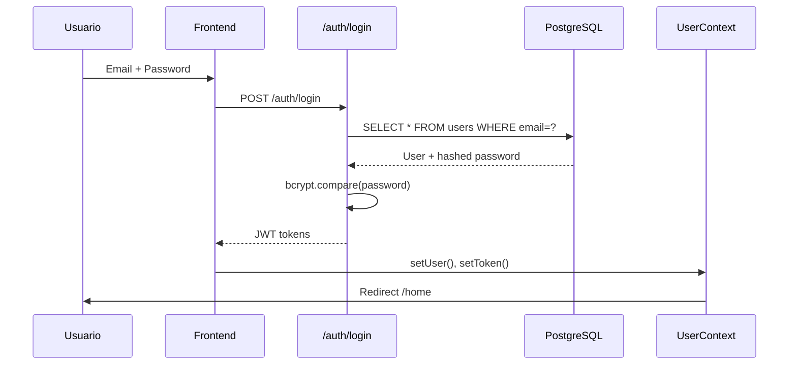
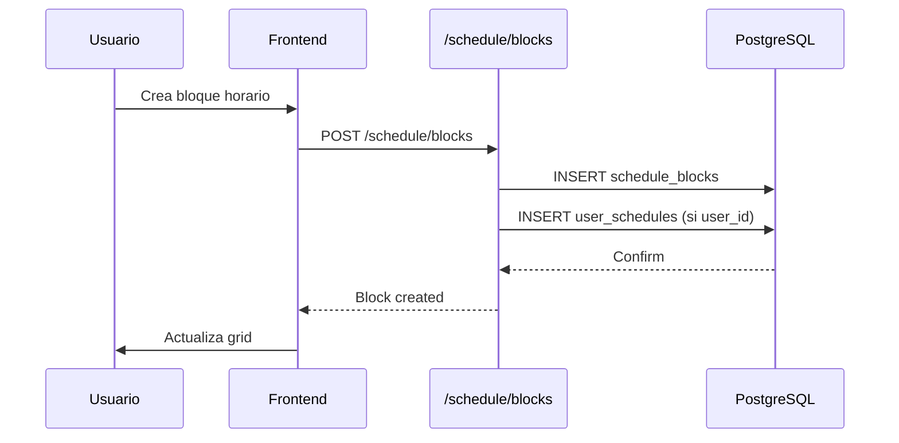
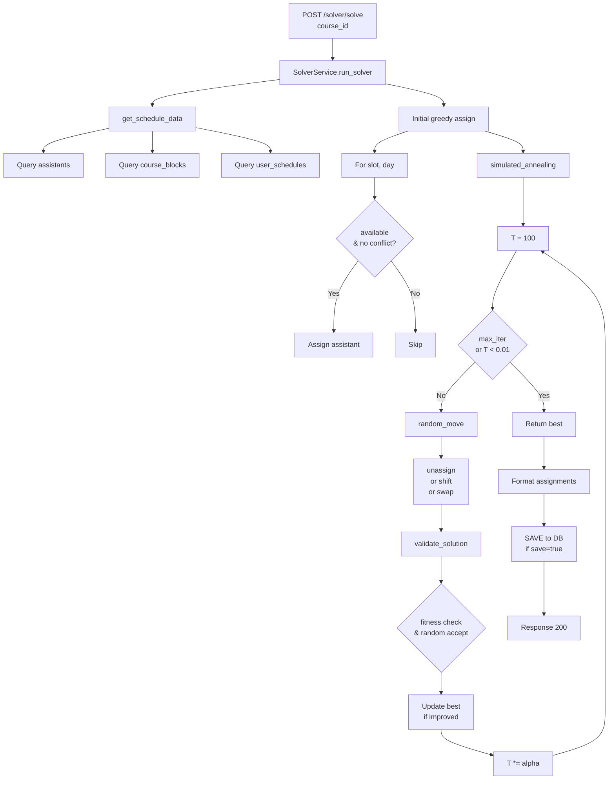
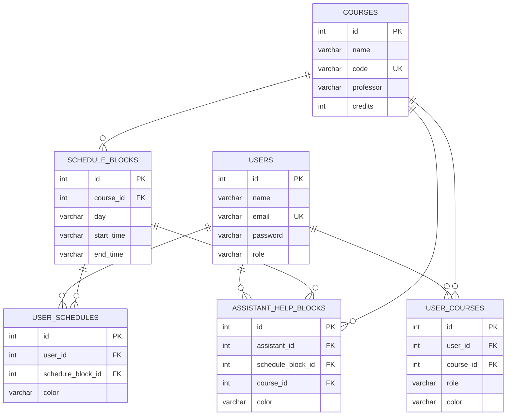

# Arquitectura del Sistema

Documento técnico que describe el diseño, flujo de datos y decisiones arquitectónicas del sistema.

## Visión General

```
┌─────────────────────────────────────────────────────────────────────────┐
│                      Frontend (React)                          │
│  ┌───────────┐  ┌───────────┐  ┌───────────┐  ┌───────────┐ │
│  │   Login   │  │   Home    │  │CourseView │  │AdminView │ │
│  └───────────┘  └───────────┘  └───────────┘  └───────────┘ │
│                         │                                    │
│                    UserContext                              │
└─────────────────────────┼───────────────────────────────────┘
                          │ HTTP
┌─────────────────────────┼───────────────────────────────────┐
│                         ▼                                    │
│                  Backend (FastAPI)                         │
│  ┌───────────┐  ┌───────────┐  ┌───────────┐  ┌───────────┐ │
│  │auth.py   │  │courses.py│  │schedule.py│  │ solver.py│ │
│  └───────────┘  └───────────┘  └───────────┘  └───────────┘ │
│                         │                                    │
│                   SolverService                             │
│           ┌────────────────────────┐                      │
│           │simulated_annealing.py │                      │
│           └────────────────────────┘                      │
│                         │                                    │
│              SQLAlchemy + asyncpg                          │
└─────────────────────────┼───────────────────────────────────┘
                          │
┌─────────────────────────┼───────────────────────────────────┐
│                         ▼                                    │
│                 PostgreSQL 17                              │
│  ┌─────────┐  ┌─────────┐  ┌─────────┐  ┌─────────────┐  │
│  │ users   │  │ courses │  │schedule_│  │assistant_  │  │
│  │         │  │         │  │ blocks  │  │ help_blocks│  │
│  └─────────┘  └─────────┘  └─────────┘  └─────────────┘  │
└─────────────────────────────────────────────────────────────┘
```

## Arquitectura de Capas

### Capa de Presentación (Frontend)

```
Browser ──► React App ──► Components ──► Views
                │
                ▼
         UserContext (State)
                │
                ▼
           API Client (Axios)
```

| Componente | Responsabilidad |
|-----------|----------------|
| `App.tsx` | Routing, providers |
| `UserContext` | Estado global, autenticación |
| `Views` | Páginas específicas |
| `Components` | UI reutilizable |

### Capa de Aplicación (Backend API)

```
Request ──► FastAPI Router ──► Service ──► Repository/DB
                │
                ▼
          Security Layer (JWT)
```

| Componente | Responsabilidad |
|-----------|----------------|
| `api/v1/*.py` | Endpoints REST |
| `services/` | Lógica de negocio |
| `schemas/` | Validación serialización |

### Capa de Datos

```
Service ──► SQLAlchemy ──► asyncpg ──► PostgreSQL
                 │
                 ▼
            ORM Models
```

| Componente | Responsabilidad |
|-----------|----------------|
| `models/*.py` | Definiciones de tabla |
| `db/session.py` | Engine, conexiones |
| `alembic/` | Migraciones |

## Flujo de Datos

### 1. Autenticación



**Características:**
- Rate limiting: `slowapi` (5请求/minuto)
- Tokens: Access (60min) + Refresh (7 días)
- Almacenamiento: localStorage

### 2. Gestión de Horarios



**Validaciones:**
- Hora fin > hora inicio
- Día válido (DAY_MAP)
- Sin conflictos con bloques existentes

### 3. Optimización con SA



## Modelo de Datos

### Esquema ER



### Detalle de Tablas

#### `users`

| Columna | Tipo | Restricciones |
|---------|------|-------------|
| `id` | INTEGER | PK, AUTOINCREMENT |
| `name` | VARCHAR(255) | NOT NULL |
| `email` | VARCHAR(255) | NOT NULL, UNIQUE |
| `password` | VARCHAR(255) | NOT NULL |
| `role` | VARCHAR(20) | NOT NULL, DEFAULT='USER' |

#### `courses`

| Columna | Tipo | Restricciones |
|---------|------|-------------|
| `id` | INTEGER | PK, AUTOINCREMENT |
| `name` | VARCHAR(255) | NOT NULL |
| `code` | VARCHAR(50) | NOT NULL, UNIQUE |
| `professor` | VARCHAR(255) | NOT NULL |
| `credits` | INTEGER | NOT NULL |

#### `schedule_blocks`

| Columna | Tipo | Restricciones |
|---------|------|-------------|
| `id` | INTEGER | PK, AUTOINCREMENT |
| `course_id` | INTEGER | FK → courses.id |
| `day` | VARCHAR(20) | NOT NULL |
| `start_time` | VARCHAR(10) | NOT NULL |
| `end_time` | VARCHAR(10) | NOT NULL |

#### `user_courses`

| Columna | Tipo | Restricciones |
|---------|------|-------------|
| `id` | INTEGER | PK, AUTOINCREMENT |
| `user_id` | INTEGER | FK → users.id |
| `course_id` | INTEGER | FK → courses.id |
| `role` | VARCHAR(20) | NOT NULL |
| `color` | VARCHAR(7) | NULLABLE |

#### `assistant_help_blocks`

| Columna | Tipo | Restricciones |
|---------|------|-------------|
| `id` | INTEGER | PK, AUTOINCREMENT |
| `assistant_id` | INTEGER | FK → users.id |
| `schedule_block_id` | INTEGER | FK → schedule_blocks.id |
| `course_id` | INTEGER | FK → courses.id |
| `color` | VARCHAR(7) | NULLABLE |

## Decisiones Arquitectónicas

### 1. Tech Stack

| Decisión | Razón |
|----------|-------|
| FastAPI | Productivo, async nativo, documentación automática |
| SQLAlchemy 2.0 | Async support, migrations con Alembic |
| asyncpg | Driver nativo async para PostgreSQL |
| React 19 | Concurrent features, Vite para build |
| SA Algorithm | Código propio, sin licensing de solvers IP |

### 2. Patrones Utilizados

| Patrón | Aplicación |
|--------|------------|
| Repository | `SolverService._get_assistants()` |
| Service Layer | `services/*.py` |
| Factory | `simulated_annealing.random_move()` |
| Strategy | `fitness_fn` como parámetro |

### 3. Seguridad

- **Auth**: JWT con `python-jose`
- **Passwords**: `bcrypt` hashing
- **Rate Limiting**: `slowapi` en `/auth/login`
- **CORS**: Configurable via `ALLOWED_ORIGINS`

### 4. Estado en Frontend

| Storage | Uso |
|---------|-----|
| localStorage | user, token, refreshToken, schedule, courses |
| React Context | Estado global reactivo |
| Props drilling | Datos de ruta (course/:id) |

## APIs Externas

### Frontend → Backend

```typescript
// Ejemplo de llamada
const response = await fetch('http://localhost:8000/api/v1/courses/', {
  headers: {
    'Authorization': `Bearer ${token}`,
    'Content-Type': 'application/json',
  },
});
```

## Métricas del Sistema

| Métrica | Valor |
|--------|-------|
| Tiempo build frontend | ~5s (Vite) |
|Tiempo build backend | ~2s (Uvicorn) |
| Límite rate login | 5/min |
| Timeout JWT access | 60 min |
| Timeout JWT refresh | 7 días |
| Máx iteraciones SA | 3000 |
| Temperatura inicial SA | 100.0 |
| Temperatura final SA | 0.01 |

