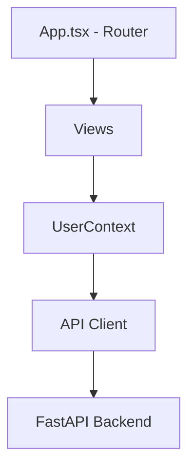
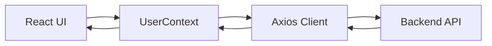

# Frontend - Asigna tu ayudantía

Single Page Application (SPA) built with React, TypeScript, and Vite.  
Provides the user interface for managing schedules, courses, and assistant assignments.

This frontend consumes the FastAPI backend and allows users to interact with the scheduling system and optimization workflow.

---

## 🚀 Quick Start

```bash
cd frontend

docker compose up --build
````

Application runs at: [http://localhost:3000](http://localhost:3000)

> ⚠️ Requires backend running at `http://localhost:8000`

---

## 🎯 What does this frontend do?

The UI is designed around three main user roles:

* **Students**

  * Define availability (schedule blocks)
  * View assigned schedules

* **Assistants**

  * See assigned courses and time blocks
  * Manage availability constraints

* **Admins**

  * Manage users and courses
  * Assign assistants
  * Trigger optimization (Simulated Annealing)

---

## 🧩 Key Features

* Schedule visualization using a grid-based layout
* Real-time interaction with backend API (Axios)
* Global state management via React Context
* Role-based navigation and protected routes
* Integration with optimization workflow (solver execution)

---

## 🏗️ Architecture Overview



* **Views** handle user interaction
* **Context** manages global state (auth, schedules, courses)
* **API layer** abstracts HTTP communication with backend

---

## 📁 Project Structure

```
src/
├── api/            # Axios-based HTTP client
├── views/          # Application pages (routes)
├── components/     # Reusable UI components
├── context/        # Global state (UserContext)
├── styles/         # CSS styles
├── App.tsx         # Router configuration
└── main.tsx        # Entry point
```

---

## 🔐 Authentication Flow

* Users authenticate via `/auth/login`
* JWT access token is stored locally
* Axios interceptor attaches token to each request
* Protected routes restrict access by role

---

## 🔄 Data Flow



---

## 🧠 Design Notes

* **React Context over Redux**
  Simpler state model, sufficient for current scale.

* **Component-based UI**
  Separation between views (pages) and reusable components improves maintainability.

* **Grid-based schedule representation**
  Designed for clarity when visualizing time blocks and constraints.

* **Tight backend integration**
  Frontend acts as a thin layer over the API, keeping business logic in the backend.

---

```
